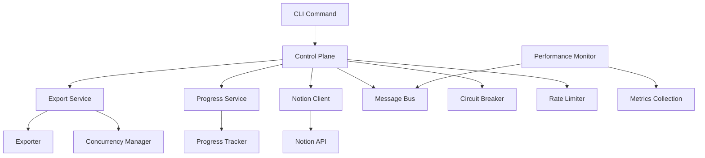

# Notion Sync - API Documentation

## Overview

Notion Sync is a production-ready, event-driven system for exporting Notion workspaces with advanced features including fault tolerance, rate limiting, progress tracking, and comprehensive monitoring.

## Architecture

### Core Components



## API Reference

### Configuration System

#### `loadConfig(options?: ConfigOptions): Promise<AppConfig>`

Load configuration from multiple sources with validation.

**Parameters:**

- `options.configFile` - Path to configuration file
- `options.envPrefix` - Environment variable prefix (default: 'NOTION_SYNC_')
- `options.validate` - Enable validation (default: true)
- `options.schema` - Custom Zod schema for validation

**Returns:** Complete application configuration

**Example:**

```typescript
import { loadConfig } from './config';

const config = await loadConfig({
  configFile: 'my-config.json',
  envPrefix: 'MY_APP_'
});
```

#### Configuration Schema

```typescript
interface AppConfig {
  notion: {
    apiKey: string;
    apiVersion: string;
    baseUrl: string;
    timeout: number;
    retryAttempts: number;
  };
  export: {
    defaultOutputPath: string;
    defaultFormat: 'json' | 'markdown' | 'html' | 'csv';
    maxConcurrency: number;
    chunkSize: number;
    enableResume: boolean;
    maxDepth: number;
    includeArchived: boolean;
  };
  performance: {
    rateLimits: Record<string, number>;
    circuitBreaker: {
      failureThreshold: number;
      resetTimeout: number;
      monitoringPeriod: number;
    };
    caching: {
      enabled: boolean;
      ttl: number;
      maxSize: number;
    };
    memoryLimits: {
      heapWarningThreshold: number;
      heapErrorThreshold: number;
      autoGcThreshold: number;
    };
  };
  monitoring: {
    enableMetrics: boolean;
    enableLogging: boolean;
    logLevel: 'debug' | 'info' | 'warn' | 'error';
    enableHealthCheck: boolean;
    metricsPort: number;
    healthCheckPort: number;
  };
  security: {
    enableApiKeyRotation: boolean;
    apiKeyRotationInterval: number;
    enableRequestSigning: boolean;
    maxRequestSize: number;
    allowedOrigins: string[];
    enableCors: boolean;
  };
  deployment: {
    environment: 'development' | 'staging' | 'production';
    nodeEnv: string;
    port: number;
    enableClusterMode: boolean;
    maxWorkers: number;
    gracefulShutdownTimeout: number;
  };
}
```

### Export System

#### `ExportService.createExport(config: ExportConfiguration): Promise<Export>`

Create a new export with the specified configuration.

**Parameters:**

```typescript
interface ExportConfiguration {
  outputPath: string;
  format: ExportFormat;
  includeBlocks: boolean;
  includeComments: boolean;
  includeProperties: boolean;
  databases: string[];
  pages: string[];
}
```

**Returns:** Export domain object

**Database Export Behavior:**
When exporting databases, the system automatically:

1. **Exports database metadata** (schema, properties, configuration)
2. **Exports all pages within the database** (all rows/records)
3. **Handles pagination** for large databases with 100+ pages
4. **Provides detailed progress** showing both database and page counts

**Example:**

```typescript
const exportService = new ExportService(eventPublisher, notionClient);

const export_ = await exportService.createExport({
  outputPath: './my-export',
  format: ExportFormat.JSON,
  includeBlocks: true,
  includeComments: true,
  includeProperties: true,
  databases: ['database-id-1', 'database-id-2'], // Exports both metadata AND all pages
  pages: ['page-id-1'] // Additional standalone pages
});

// Start the export
await exportService.startExport(export_.id);
```

**Note:** When you specify databases in the configuration, you get both the database structure AND all the content within it. This ensures complete data export without manually specifying each individual page ID.

#### `Export` Domain Model

The `Export` class represents the core business entity for exports.

**Key Methods:**

- `start(): void` - Transition export to running state
- `complete(outputPath: string): void` - Mark export as completed
- `fail(error: ExportError): void` - Mark export as failed
- `cancel(reason: string): void` - Cancel the export
- `updateProgress(update: ProgressUpdate): void` - Update export progress
- `addError(error: ExportError): void` - Add error to export
- `getDuration(): number | null` - Get export duration in milliseconds
- `getSuccessRate(): number` - Get success rate (0-1)
- `isRunning(): boolean` - Check if export is currently running
- `isCompleted(): boolean` - Check if export is completed
- `canBeRestarted(): boolean` - Check if export can be restarted

**Events:**

- `export.started` - Export has started
- `export.completed` - Export completed successfully
- `export.failed` - Export failed
- `export.cancelled` - Export was cancelled
- `export.progress.updated` - Export progress updated

### Progress Tracking

#### `ProgressService.startTracking(exportId: string): Promise<void>`

Initialize progress tracking for an export.

#### `ProgressService.startSection(exportId: string, section: string, totalItems: number): Promise<void>`

Start tracking progress for a specific section.

#### `ProgressService.updateSectionProgress(exportId: string, section: string, processedItems: number): Promise<void>`

Update progress for a section.

#### `ProgressService.getProgress(exportId: string): ProgressUpdate`

Get current progress for an export.

**Returns:**

```typescript
interface ProgressUpdate {
  processed: number;
  total: number;
  percentage: number;
  currentOperation: string;
  estimatedCompletion?: Date;
  errors: ExportError[];
}
```

### Notion Client

#### `NotionClient.getPage(pageId: string): Promise<Page>`

Retrieve a Notion page with circuit breaker protection.

#### `NotionClient.getDatabase(databaseId: string): Promise<Database>`

Retrieve a Notion database with circuit breaker protection.

#### `NotionClient.queryDatabase(databaseId: string, options?: QueryOptions): Promise<QueryResult>`

Query a Notion database with pagination support.

#### `NotionClient.getBlocks(pageId: string, cursor?: string): Promise<BlocksResult>`

Get blocks from a page with pagination.

**Error Handling:**
All Notion client methods handle rate limiting, retries, and circuit breaker logic automatically.

**Events:**

- `notion.object.fetched` - Object successfully retrieved
- `notion.rate_limit.hit` - Rate limit encountered
- `notion.api.error` - API error occurred

### Performance Monitoring

#### `PerformanceMonitor.start(): void`

Start performance monitoring and metrics collection.

#### `PerformanceMonitor.measureFunction<T>(name: string, fn: () => Promise<T>, labels?: Record<string, string>): Promise<{ result: T; duration: number }>`

Measure execution time of a function.

**Example:**

```typescript
const monitor = getPerformanceMonitor();

const { result, duration } = await monitor.measureFunction(
  'notion_api_call',
  () => notionClient.getPage('page-id'),
  { operation: 'get_page' }
);

console.log(`API call took ${duration}ms`);
```

#### `PerformanceMonitor.getExportMetrics(): ExportMetrics`

Get comprehensive export performance metrics.

**Returns:**

```typescript
interface ExportMetrics {
  totalApiCalls: number;
  totalDataExported: number;
  averageResponseTime: number;
  errorRate: number;
  rateLimitHits: number;
  cacheHitRate: number;
  concurrencyUtilization: number;
  throughputPerSecond: number;
  memoryEfficiency: number;
}
```

#### `@measured(metricName?: string)` Decorator

Automatically measure method execution time.

**Example:**

```typescript
class MyService {
  @measured('database_query')
  async queryDatabase(id: string): Promise<Database> {
    // Method implementation
    // Execution time will be automatically measured
  }
}
```

### Control Plane

The control plane provides event-driven coordination and fault tolerance.

#### `ControlPlane.start(): Promise<void>`

Start the control plane with all components.

#### `ControlPlane.stop(): Promise<void>`

Gracefully stop the control plane.

#### Message Bus

The message bus enables loose coupling between components.

**Publishing Events:**

```typescript
await messageBus.publish('export.started', {
  exportId: 'export-123',
  configuration: exportConfig,
  timestamp: new Date()
});
```

**Subscribing to Events:**

```typescript
messageBus.subscribe('export.progress.updated', async (event) => {
  console.log(`Export ${event.payload.exportId}: ${event.payload.percentage}%`);
});
```

#### Circuit Breaker

Automatic fault tolerance for external dependencies.

**Configuration:**

```typescript
interface CircuitBreakerConfig {
  failureThreshold: number;    // Number of failures before opening
  resetTimeout: number;        // Time before attempting reset
  monitoringPeriod: number;    // Period for failure rate calculation
}
```

**States:**

- `closed` - Normal operation
- `open` - Failing, rejecting calls
- `half-open` - Testing if service recovered

## Error Handling

### Error Types

```typescript
interface ExportError {
  id: string;
  message: string;
  code: string;
  timestamp: Date;
  context?: Record<string, any>;
  stack?: string;
  retryCount?: number;
}
```

### Common Error Codes

- `NOTION_API_ERROR` - Notion API returned an error
- `RATE_LIMIT_EXCEEDED` - Rate limit hit
- `CIRCUIT_BREAKER_OPEN` - Circuit breaker protecting from failures
- `VALIDATION_ERROR` - Configuration or data validation failed
- `NETWORK_ERROR` - Network connectivity issue
- `AUTHENTICATION_ERROR` - Invalid API key or permissions
- `EXPORT_CANCELLED` - Export was cancelled by user
- `MEMORY_PRESSURE` - System running low on memory

### Error Recovery

The system implements automatic error recovery strategies:

1. **Exponential Backoff**: Automatic retry with increasing delays
2. **Circuit Breaking**: Prevent cascade failures
3. **Graceful Degradation**: Continue processing when possible
4. **Checkpoint Recovery**: Resume from last successful state

## CLI Usage

### Basic Export

```bash
notion-sync export \
  --api-key=your-notion-api-key \
  --output=./exports \
  --format=json \
  --databases=db1,db2 \
  --pages=page1,page2
```

### Advanced Export with Configuration

```bash
notion-sync export \
  --config=./notion-sync.config.json \
  --max-concurrency=8 \
  --include-archived=true \
  --enable-resume=true \
  --verbose
```

### Monitor Export Progress

```bash
notion-sync status export-id-123
```

### Configuration File Example

```json
{
  "notion": {
    "apiKey": "your-api-key",
    "timeout": 30000,
    "retryAttempts": 3
  },
  "export": {
    "defaultOutputPath": "./exports",
    "defaultFormat": "json",
    "maxConcurrency": 5,
    "enableResume": true
  },
  "performance": {
    "rateLimits": {
      "pages": 10,
      "blocks": 15,
      "databases": 5
    }
  },
  "monitoring": {
    "enableMetrics": true,
    "logLevel": "info"
  }
}
```

## Environment Variables

All configuration can be overridden with environment variables:

```bash
# Notion API Configuration
export NOTION_SYNC_NOTION_API_KEY="your-api-key"
export NOTION_SYNC_NOTION_TIMEOUT="45000"

# Export Configuration  
export NOTION_SYNC_EXPORT_MAX_CONCURRENCY="8"
export NOTION_SYNC_EXPORT_FORMAT="markdown"

# Performance Configuration
export NOTION_SYNC_PERF_RATE_LIMIT_PAGES="15"
export NOTION_SYNC_PERF_CIRCUIT_BREAKER_THRESHOLD="3"

# Monitoring Configuration
export NOTION_SYNC_MONITORING_ENABLE_METRICS="true"
export NOTION_SYNC_MONITORING_LOG_LEVEL="debug"
```

## Events Reference

### Export Events

- `export.created` - New export created
- `export.started` - Export started processing
- `export.progress.updated` - Progress update
- `export.section.started` - Section processing started
- `export.section.completed` - Section completed
- `export.completed` - Export completed successfully
- `export.failed` - Export failed
- `export.cancelled` - Export cancelled

### Progress Events

- `progress.section.started` - Section tracking started
- `progress.section.completed` - Section completed
- `progress.item.processed` - Individual item processed

### System Events

- `monitoring.started` - Performance monitoring started
- `monitoring.stopped` - Performance monitoring stopped
- `memory.pressure` - Memory pressure detected
- `gc.forced` - Garbage collection forced
- `alert.triggered` - Performance alert triggered
- `alert.resolved` - Performance alert resolved

### Notion API Events

- `notion.object.fetched` - Object retrieved from API
- `notion.rate_limit.hit` - Rate limit encountered
- `notion.api.error` - API error occurred

## Metrics

### Counter Metrics

- `api_calls_total` - Total API calls made
- `requests_errors_total` - Total failed requests
- `cache_hits_total` - Cache hits
- `cache_misses_total` - Cache misses
- `rate_limit_hits_total` - Rate limit encounters

### Gauge Metrics

- `concurrent_operations_active` - Active concurrent operations
- `memory_heap_used_bytes` - Current heap usage
- `export_progress_percentage` - Current export progress

### Histogram Metrics

- `api_response_time_duration` - API response times
- `export_duration_seconds` - Export completion times
- `memory_gc_duration_seconds` - Garbage collection times

## Health Checks

### Endpoint: `GET /health`

Returns system health status:

```json
{
  "status": "healthy",
  "timestamp": "2023-01-01T00:00:00.000Z",
  "checks": {
    "memory": "ok",
    "notion_api": "ok",
    "exports": "ok"
  },
  "metrics": {
    "uptime": 3600,
    "memory_usage_mb": 150,
    "active_exports": 2
  }
}
```

### Health Check Status Codes

- `200` - System healthy
- `503` - System unhealthy or degraded

## Deployment

### Docker

```dockerfile
FROM node:18-alpine
WORKDIR /app
COPY package*.json ./
RUN npm ci --production
COPY . .
EXPOSE 3000
CMD ["npm", "start"]
```

### Kubernetes

```yaml
apiVersion: apps/v1
kind: Deployment
metadata:
  name: notion-sync
spec:
  replicas: 3
  selector:
    matchLabels:
      app: notion-sync
  template:
    metadata:
      labels:
        app: notion-sync
    spec:
      containers:
      - name: notion-sync
        image: notion-sync:latest
        ports:
        - containerPort: 3000
        env:
        - name: NOTION_SYNC_NOTION_API_KEY
          valueFrom:
            secretKeyRef:
              name: notion-secrets
              key: api-key
        resources:
          requests:
            memory: "256Mi"
            cpu: "250m"
          limits:
            memory: "512Mi"
            cpu: "500m"
```

### Production Checklist

- [ ] Configure API key rotation
- [ ] Set up monitoring and alerting
- [ ] Configure log aggregation
- [ ] Set appropriate resource limits
- [ ] Enable health checks
- [ ] Configure backup strategies
- [ ] Set up error tracking
- [ ] Configure rate limiting
- [ ] Enable security features
- [ ] Test disaster recovery

## Troubleshooting

### Common Issues

**Rate Limit Errors**

- Reduce `maxConcurrency` setting
- Increase delays between requests
- Check API quota and limits

**Memory Issues**

- Reduce `chunkSize` in configuration
- Enable garbage collection monitoring
- Check for memory leaks in custom code

**Export Failures**

- Check API key permissions
- Verify network connectivity
- Review error logs for specific issues
- Check if objects still exist in Notion

**Performance Issues**

- Enable performance monitoring
- Check concurrency settings
- Review rate limiting configuration
- Monitor memory usage patterns

### Debug Mode

Enable debug logging:

```bash
NOTION_SYNC_MONITORING_LOG_LEVEL=debug npm start
```

### Log Analysis

Logs are structured JSON for easy parsing:

```json
{
  "level": "info",
  "timestamp": "2023-01-01T00:00:00.000Z",
  "message": "Export started",
  "exportId": "export-123",
  "configuration": {...},
  "context": {...}
}
```

## Support

For issues and questions:

1. Check the troubleshooting section
2. Review error logs and metrics
3. Enable debug mode for detailed logging
4. Create GitHub issue with reproduction steps
