# NotionKit - Event-Driven Architecture

## 🎯 Executive Summary

NotionKit implements a sophisticated **event-driven architecture** that combines reactive programming, plugin extensibility, and type-safe validation to create a scalable, maintainable, and performant Notion API integration platform.

## 🏗️ Top-Down Architecture Overview

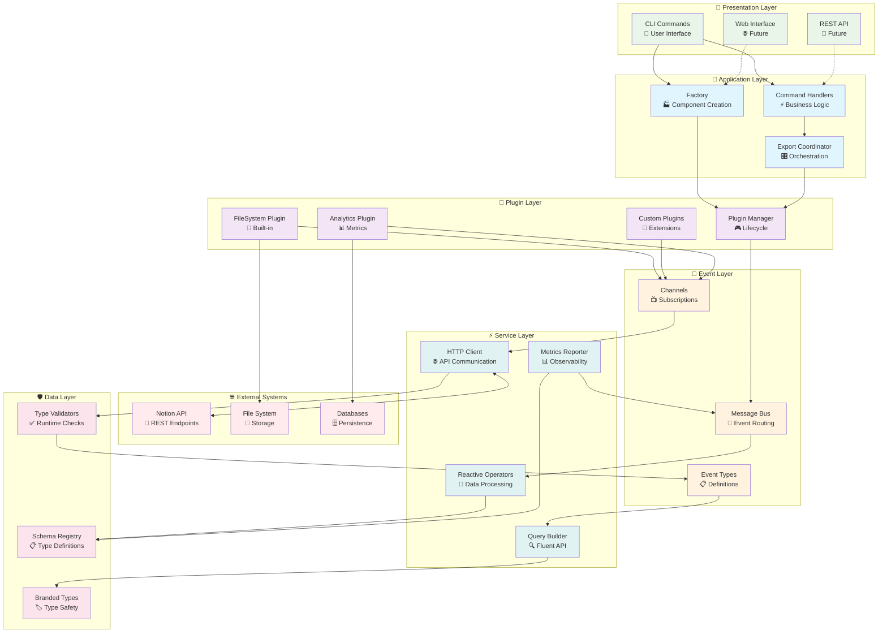

## 🔄 Event-Driven Flow Architecture

### Core Event Flow Pattern

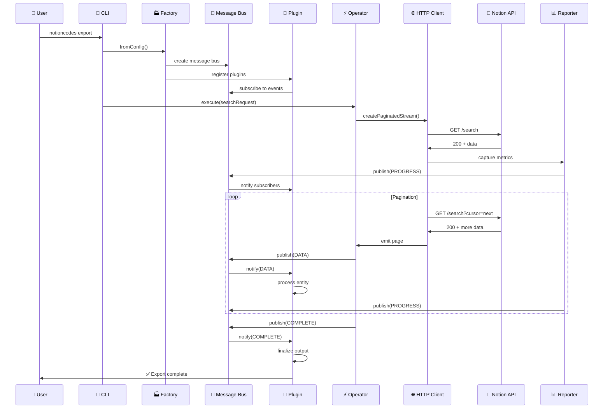

### Reactive Stream Architecture

```mermaid
graph LR
    subgraph "🌐 HTTP Layer"
        FETCH[fromFetch<br/>Raw HTTP Request]
        SHARE[shareReplay(1)<br/>Shared Execution]
        RETRY[retryWhen<br/>Exponential Backoff]
    end
    
    subgraph "🔄 Operator Layer"
        DEFER[defer<br/>Lazy Execution]
        EXPAND[expand<br/>Recursive Pagination]
        TAKE[takeUntil<br/>Cancellation]
        MAP[map<br/>Data Transformation]
    end
    
    subgraph "📊 Metrics Layer"
        REPORTER[MetricsReporter<br/>State Management]
        SUBJECT[BehaviorSubject<br/>Live State]
        DISTINCT[distinctUntilChanged<br/>Efficiency]
    end
    
    subgraph "🔌 Plugin Layer"
        PUBLISH[publish<br/>Event Emission]
        SUBSCRIBE[subscribe<br/>Event Handling]
        CHANNEL[Channel<br/>Event Routing]
    end
    
    FETCH --> SHARE
    SHARE --> RETRY
    RETRY --> DEFER
    DEFER --> EXPAND
    EXPAND --> TAKE
    TAKE --> MAP
    MAP --> REPORTER
    REPORTER --> SUBJECT
    SUBJECT --> DISTINCT
    DISTINCT --> PUBLISH
    PUBLISH --> SUBSCRIBE
    SUBSCRIBE --> CHANNEL
    
    classDef httpLayer fill:#e1f5fe
    classDef operatorLayer fill:#e8f5e8
    classDef metricsLayer fill:#fff3e0
    classDef pluginLayer fill:#f3e5f5
    
    class FETCH,SHARE,RETRY httpLayer
    class DEFER,EXPAND,TAKE,MAP operatorLayer
    class REPORTER,SUBJECT,DISTINCT metricsLayer
    class PUBLISH,SUBSCRIBE,CHANNEL pluginLayer
```

## 📦 Package Architecture Deep Dive

### CLI Package (@mateothegreat/notion-sync)

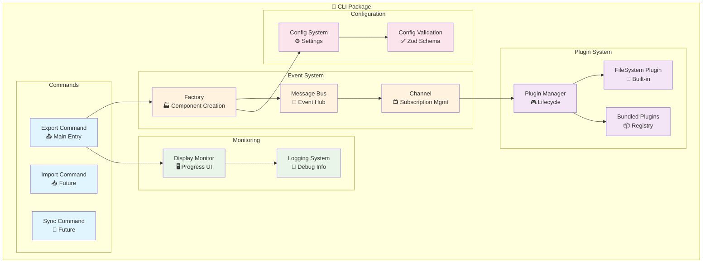

### SDK Package (@notion.codes/sdk)

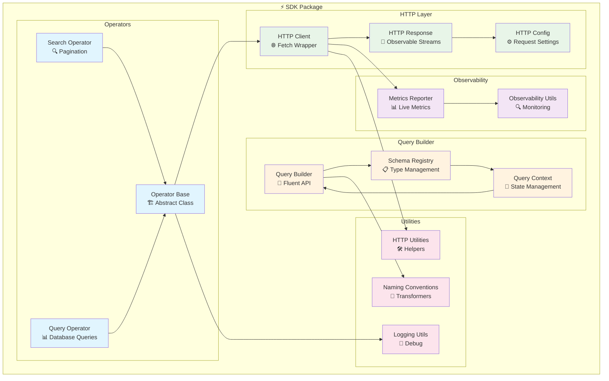

### Types Package (@notion.codes/types)

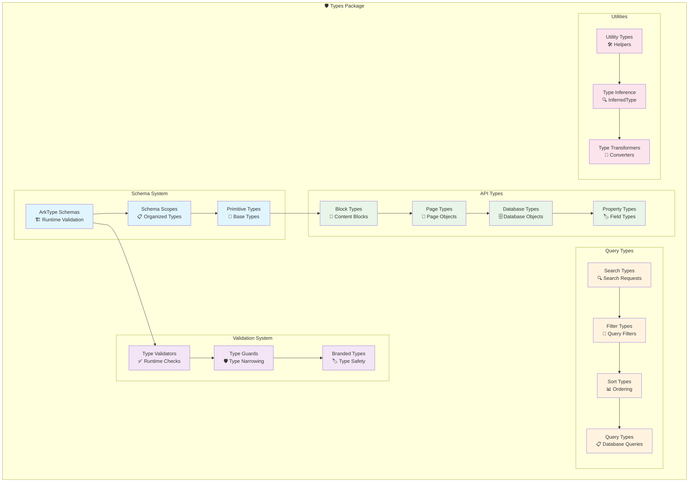

## 🔄 Event System Deep Dive

### Event Types and Flow

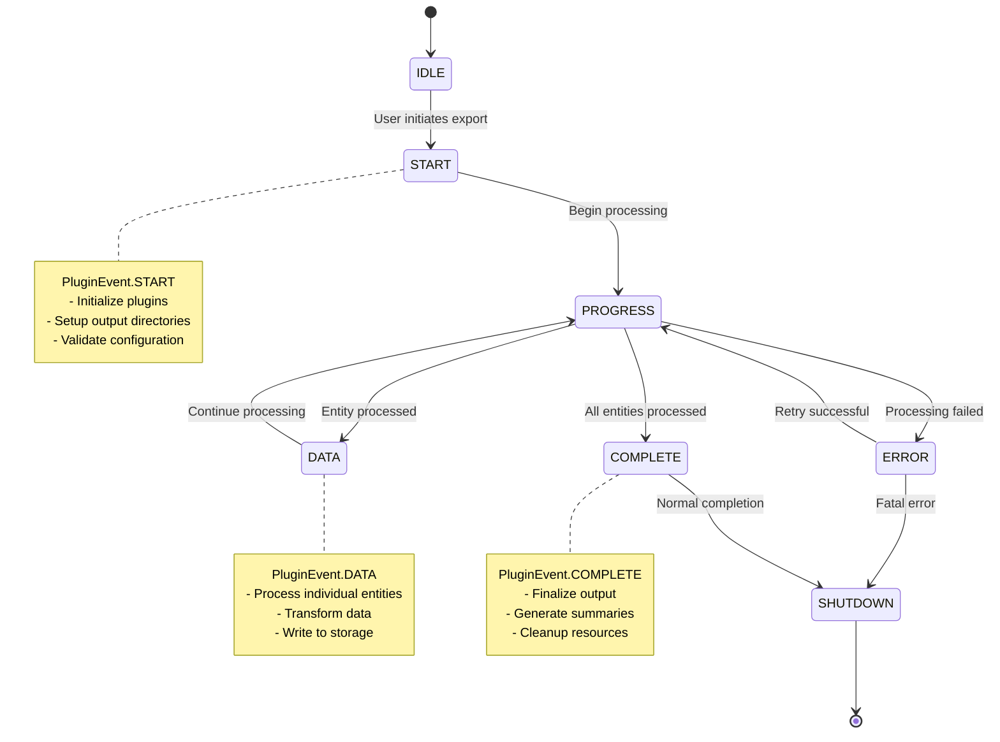

### Plugin Event Handling

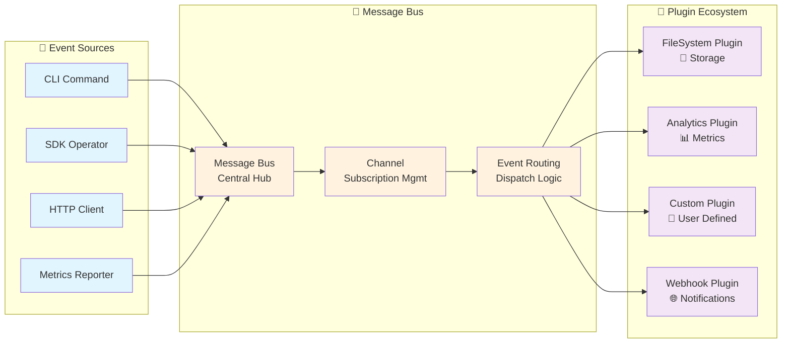

## 🎯 Performance Architecture

### Reactive Stream Optimization

```mermaid
graph TB
    subgraph "🌐 HTTP Optimization"
        SHARE[shareReplay(1)<br/>🔄 Shared Execution]
        RETRY[retryWhen<br/>⏰ Exponential Backoff]
        TIMEOUT[timeout<br/>⏱️ Request Timeout]
    end
    
    subgraph "💾 Memory Management"
        DISTINCT[distinctUntilChanged<br/>🔍 Duplicate Prevention]
        BUFFER[bufferTime<br/>⏱️ Batch Processing]
        THROTTLE[throttleTime<br/>🚦 Rate Limiting]
    end
    
    subgraph "🔄 Pagination Optimization"
        EXPAND[expand<br/>♻️ Recursive Fetching]
        TAKE[takeUntil<br/>🛑 Cancellation]
        SCAN[scan<br/>📊 Accumulation]
    end
    
    subgraph "📊 Metrics Optimization"
        BEHAVIOR[BehaviorSubject<br/>📡 Live State]
        SHALLOW[shallowEqual<br/>⚡ Efficient Comparison]
        DEBOUNCE[debounceTime<br/>🔄 Update Batching]
    end
    
    SHARE --> DISTINCT
    RETRY --> BUFFER
    TIMEOUT --> THROTTLE
    
    EXPAND --> BEHAVIOR
    TAKE --> SHALLOW
    SCAN --> DEBOUNCE
    
    classDef http fill:#e1f5fe
    classDef memory fill:#e8f5e8
    classDef pagination fill:#fff3e0
    classDef metrics fill:#f3e5f5
    
    class SHARE,RETRY,TIMEOUT http
    class DISTINCT,BUFFER,THROTTLE memory
    class EXPAND,TAKE,SCAN pagination
    class BEHAVIOR,SHALLOW,DEBOUNCE metrics
```

### Scalability Patterns

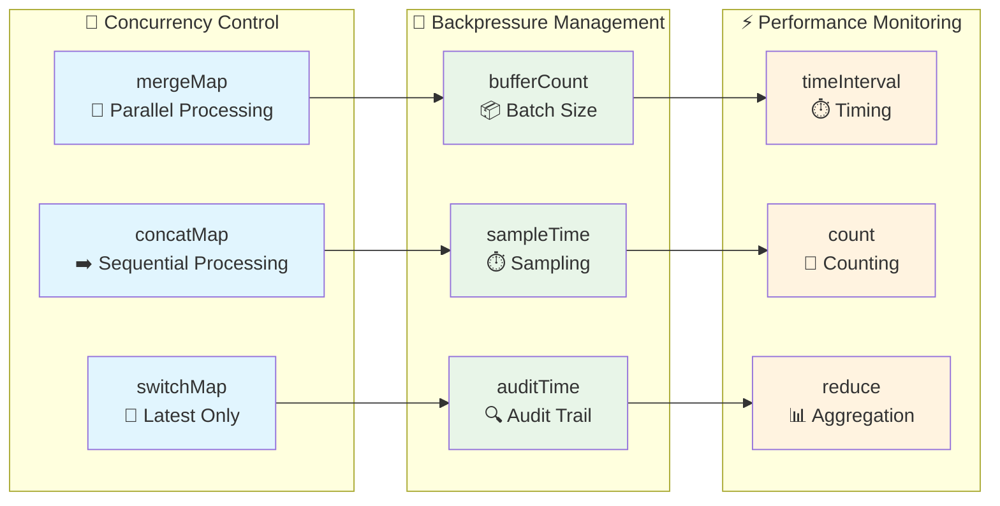

## 🛡️ Type Safety Architecture

### Runtime Validation Flow

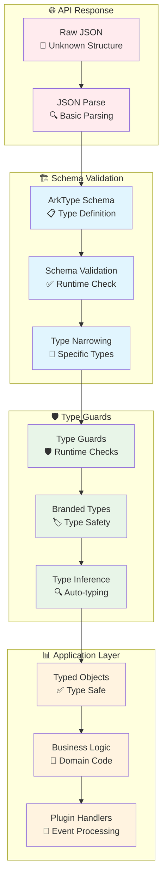

## 🔍 Monitoring & Observability

### Metrics Architecture

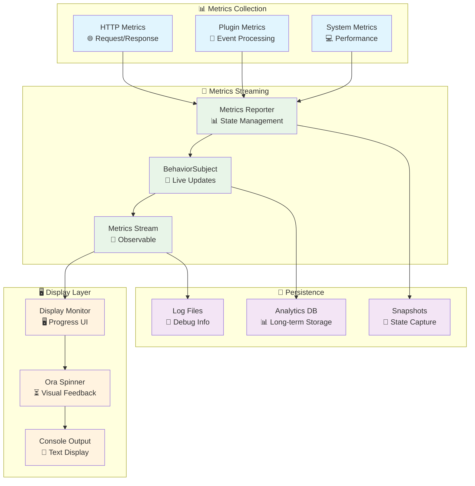

## 🚀 Future Architecture Evolution

### Planned Enhancements

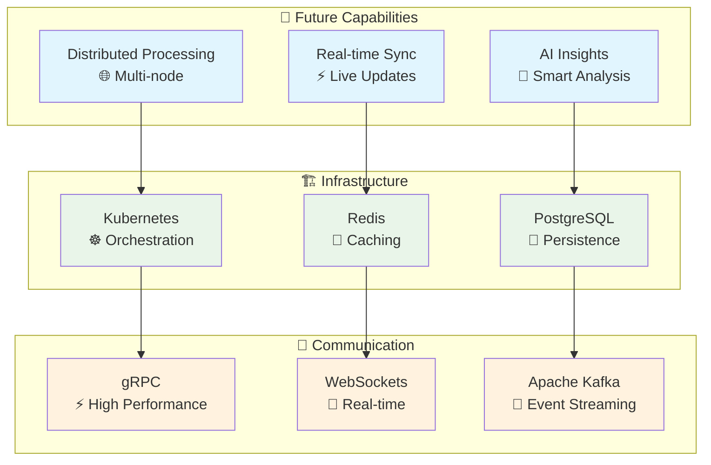

## 📋 Architecture Principles

### 🎯 Core Principles

1. **Event-Driven**: All operations flow through events for loose coupling
2. **Reactive**: RxJS observables for handling async operations
3. **Type-Safe**: Runtime validation with compile-time checking
4. **Extensible**: Plugin architecture for customization
5. **Observable**: Comprehensive monitoring and metrics
6. **Fault-Tolerant**: Graceful error handling and recovery

### 🔧 Design Patterns

- **Factory Pattern**: Component creation and configuration
- **Observer Pattern**: Event-driven communication
- **Strategy Pattern**: Pluggable algorithms and behaviors
- **Builder Pattern**: Fluent API construction
- **Decorator Pattern**: Middleware and plugin composition

### 🚀 Performance Goals

- **Memory Efficiency**: Bounded memory usage through streaming
- **Scalability**: Horizontal scaling through event distribution
- **Reliability**: 99.9% uptime with automatic recovery
- **Throughput**: Maximum sustainable API rate utilization

---

This architecture documentation provides a comprehensive view of NotionKit's sophisticated event-driven design, enabling developers to understand, extend, and contribute to the platform effectively.
