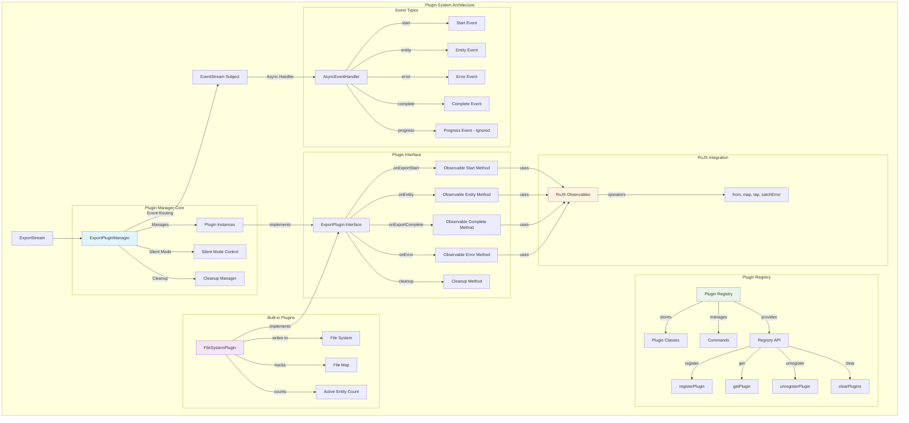

# Plugin System Architecture

The NotionKit plugin system provides a flexible, event-driven architecture for extending the export functionality. The system uses RxJS observables for reactive programming and async/await for reliable error handling.

## Overview

The plugin system consists of three main components:

1. **ExportPluginManager** - Coordinates plugin execution and event routing
2. **ExportPlugin Interface** - Defines the contract all plugins must implement
3. **Plugin Registry** - Manages global plugin registration and discovery

## Architecture Diagram


```mermaid
graph TB
    subgraph "Plugin System Architecture"
        ES[ExportStream] --> EPM[ExportPluginManager]
        EPM --> |Event Routing| ES_Subject[EventStream Subject]
        ES_Subject --> |Async Handler| AEH[AsyncEventHandler]
        
        subgraph "Plugin Manager Core"
            EPM --> |Manages| Plugins[Plugin Instances]
            EPM --> |Silent Mode| SM[Silent Mode Control]
            EPM --> |Cleanup| CM[Cleanup Manager]
        end
        
        subgraph "Event Types"
            AEH --> |start| SE[Start Event]
            AEH --> |entity| EE[Entity Event]
            AEH --> |error| ERE[Error Event]
            AEH --> |complete| CE[Complete Event]
            AEH --> |progress| PE[Progress Event - Ignored]
        end
        
        subgraph "Plugin Interface"
            Plugins --> |implements| EPI[ExportPlugin Interface]
            EPI --> |onExportStart| OSM[Observable Start Method]
            EPI --> |onEntity| OEM[Observable Entity Method]
            EPI --> |onExportComplete| OCM[Observable Complete Method]
            EPI --> |onError| OERM[Observable Error Method]
            EPI --> |cleanup| CLM[Cleanup Method]
        end
        
        subgraph "Built-in Plugins"
            FSP[FileSystemPlugin] --> |implements| EPI
            FSP --> |writes to| FS[File System]
            FSP --> |tracks| FM[File Map]
            FSP --> |counts| AEC[Active Entity Count]
        end
        
        subgraph "Plugin Registry"
            PR[Plugin Registry] --> |stores| PC[Plugin Classes]
            PR --> |manages| CMD[Commands]
            PR --> |provides| API[Registry API]
            API --> |register| REG[registerPlugin]
            API --> |get| GET[getPlugin]
            API --> |unregister| UNREG[unregisterPlugin]
            API --> |clear| CLR[clearPlugins]
        end
        
        subgraph "RxJS Integration"
            OSM --> |uses| RxJS[RxJS Observables]
            OEM --> |uses| RxJS
            OCM --> |uses| RxJS
            OERM --> |uses| RxJS
            RxJS --> |operators| OPS[from, map, tap, catchError]
        end
    end
    
    style EPM fill:#e1f5fe
    style FSP fill:#f3e5f5
    style PR fill:#e8f5e8
    style RxJS fill:#fff3e0
```

## Core Components

### ExportPluginManager

The central coordinator that manages plugin lifecycle and event routing.

**Key Features:**

- **Simplified Event Handling**: Uses async/await instead of complex RxJS merge patterns
- **Error Resilience**: Plugin errors don't stop other plugins from executing
- **Silent Mode**: Automatic silence during testing to prevent log spam
- **Promise.allSettled**: Ensures all plugins complete even if some fail

**Event Flow:**

1. Events are published to an internal RxJS Subject
2. The event handler processes events asynchronously
3. Each event type is routed to the appropriate plugin methods
4. All plugins are called in parallel using Promise.allSettled

### ExportPlugin Interface

Defines the contract that all plugins must implement:

```typescript
export interface ExportPlugin {
  onExportStart(config: ExporterConfig): Observable<void>;
  onEntity(entity: NotionEntity): Observable<void>;
  onExportComplete(summary: ExportSummary): Observable<void>;
  onError(error: Error): Observable<void>;
  cleanup(): Promise<void>;
}
```

**RxJS Integration:**

- All plugin methods return RxJS Observables
- Uses `from()` to convert Promises to Observables
- Leverages `map()`, `tap()`, and `catchError()` operators
- Simplified Observable creation vs manual subscriber handling

### FileSystemPlugin

The built-in plugin for writing exported data to the filesystem.

**Features:**

- **Reactive File Operations**: Uses RxJS observables for all I/O
- **Directory Management**: Automatically creates nested directories
- **Entity Tracking**: Maintains maps of processed entities
- **Error Handling**: Graceful error handling with proper logging
- **Silent Mode**: Respects test environment settings

**File Organization:**

```
output-dir/
├── page/
│   ├── entity-1.json
│   └── entity-2.json
├── block/
│   ├── block-1.json
│   └── block-2.json
└── export-summary.json
```

## RxJS Usage Patterns

### Simplified Observable Creation

**Before (Complex):**

```typescript
return new Observable<void>((subscriber) => {
  fs.writeFile(path, data)
    .then(() => {
      subscriber.next();
      subscriber.complete();
    })
    .catch((error) => {
      subscriber.error(error);
    });
});
```

**After (Simplified):**

```typescript
return from(fs.writeFile(path, data)).pipe(
  map((): void => undefined),
  catchError((error) => {
    if (!this.silent) {
      log.error("Error context", error);
    }
    throw error;
  })
);
```

### Event Handling Simplification

**Before (Complex RxJS):**

```typescript
this.eventStream$.pipe(
  mergeMap((payload) => {
    return merge(...plugins.map(plugin => 
      plugin.method(payload).pipe(catchError(handleError))
    )).pipe(toArray(), map(() => undefined));
  })
).subscribe();
```

**After (Async/Await):**

```typescript
this.eventStream$.subscribe({
  next: (payload) => {
    this.handleEventAsync(payload).catch(handleError);
  }
});

private async handleEventAsync(payload: ExportEventPayload): Promise<void> {
  const promises = this.plugins.map(plugin => 
    plugin.method(payload).toPromise().catch(handleError)
  );
  await Promise.allSettled(promises);
}
```

## Plugin Development Guide

### Creating a Custom Plugin

```typescript
export class CustomPlugin implements ExportPlugin {
  private silent = process.env.NODE_ENV === "test";

  onExportStart(config: ExporterConfig): Observable<void> {
    return of(undefined).pipe(
      tap(() => {
        if (!this.silent) {
          log.info("Custom plugin started");
        }
      })
    );
  }

  onEntity(entity: NotionEntity): Observable<void> {
    return from(this.processEntity(entity)).pipe(
      map((): void => undefined),
      catchError((error) => {
        if (!this.silent) {
          log.error("Custom plugin entity error", error);
        }
        throw error;
      })
    );
  }

  onExportComplete(summary: ExportSummary): Observable<void> {
    return of(undefined).pipe(
      tap(() => {
        if (!this.silent) {
          log.success("Custom plugin completed");
        }
      })
    );
  }

  onError(error: Error): Observable<void> {
    return of(undefined).pipe(
      tap(() => {
        if (!this.silent) {
          log.error("Custom plugin error", error);
        }
      })
    );
  }

  async cleanup(): Promise<void> {
    // Clean up resources
  }

  private async processEntity(entity: NotionEntity): Promise<void> {
    // Custom processing logic
  }
}
```

### Plugin Registration

```typescript
// Register a plugin globally
registerPlugin(new CustomPlugin());

// Get a registered plugin
const PluginClass = getPlugin("CustomPlugin");

// Use in export stream
const pluginManager = new ExportPluginManager([
  new FileSystemPlugin(config),
  new CustomPlugin()
]);
```

## Testing

### Test Structure

The plugin system includes comprehensive test coverage:

- **Unit Tests**: Individual plugin and manager functionality
- **Integration Tests**: End-to-end plugin workflows
- **Error Scenarios**: Plugin failure handling
- **Edge Cases**: Special characters, nested directories, etc.

### Mock Setup

```typescript
// Mock filesystem operations
vi.mock("fs/promises", () => ({
  mkdir: vi.fn().mockResolvedValue(undefined),
  writeFile: vi.fn().mockResolvedValue(undefined)
}));

// Mock logging to prevent test output
vi.mock("../utils/logging", () => ({
  log: {
    info: vi.fn(),
    error: vi.fn(),
    success: vi.fn()
  }
}));
```

### Test Patterns

```typescript
it("should handle plugin errors gracefully", async () => {
  const failingPlugin = {
    onExportStart: vi.fn().mockReturnValue(throwError(() => new Error("Plugin error"))),
    // ... other methods
  };

  const pluginManager = new ExportPluginManager([failingPlugin]);
  
  pluginManager.notify({ type: "start", config });
  
  // Wait for async operations
  await new Promise(resolve => setTimeout(resolve, 50));
  
  expect(failingPlugin.onExportStart).toHaveBeenCalled();
  // Plugin error should not crash the system
});
```

## Performance Considerations

### Async Event Processing

- Events are processed asynchronously to prevent blocking
- Uses `Promise.allSettled()` to ensure all plugins complete
- Error in one plugin doesn't affect others

### Memory Management

- Plugin manager cleans up resources on shutdown
- File maps are cleared during cleanup
- Observable subscriptions are properly disposed

### Error Handling

- Silent mode prevents log spam during testing
- Errors are logged but don't crash the system
- Individual plugin failures are isolated

## Configuration

### Environment Variables

- `NODE_ENV=test` or `VITEST=true` enables silent mode
- Prevents logging during test execution
- Maintains clean test output

### Plugin Manager Options

```typescript
const pluginManager = new ExportPluginManager([
  new FileSystemPlugin({
    outputDir: "./custom-output",
    // ... other options
  })
]);

// Configure silent mode
pluginManager.setSilentMode(true);
```

## Best Practices

1. **Error Handling**: Always handle errors gracefully in plugins
2. **Silent Mode**: Respect the silent mode flag in custom plugins
3. **Resource Cleanup**: Implement proper cleanup in the cleanup method
4. **Observable Patterns**: Use RxJS operators for cleaner code
5. **Testing**: Write comprehensive tests for custom plugins
6. **Logging**: Use the logging utility for consistent output

## Future Enhancements

1. **Plugin Discovery**: Automatic plugin loading from npm packages
2. **Plugin Configuration**: Per-plugin configuration options
3. **Plugin Dependencies**: Plugin dependency resolution
4. **Plugin Hooks**: Additional lifecycle hooks for fine-grained control
5. **Plugin Validation**: Runtime validation of plugin implementations
