# NotionKit Plugin System Architecture

## 🎯 Overview

The NotionKit plugin system provides a **powerful, event-driven architecture** for extending functionality through custom plugins. Built on reactive programming principles, it enables seamless integration of custom processing logic, output formats, and integrations.

## 🏗️ Plugin Architecture

```mermaid
graph TB
    subgraph "🎮 Plugin Management Layer"
        PLUGIN_MGR[Plugin Manager<br/>🎮 Lifecycle Coordinator]
        REGISTRY[Plugin Registry<br/>📋 Plugin Discovery]
        LOADER[Plugin Loader<br/>📦 Dynamic Loading]
    end
    
    subgraph "📡 Event System"
        MSG_BUS[Message Bus<br/>🚌 Central Hub]
        CHANNEL[Channel<br/>📺 Subscription Mgmt]
        DISPATCHER[Event Dispatcher<br/>🎯 Routing Logic]
    end
    
    subgraph "🔌 Plugin Ecosystem"
        BUNDLED[Bundled Plugins<br/>📦 Built-in]
        CUSTOM[Custom Plugins<br/>🔧 User Defined]
        COMMUNITY[Community Plugins<br/>🌐 Shared]
    end
    
    subgraph "🛡️ Plugin Infrastructure"
        ISOLATION[Error Isolation<br/>🛡️ Fault Tolerance]
        VALIDATION[Plugin Validation<br/>✅ Type Safety]
        MONITORING[Plugin Monitoring<br/>📊 Observability]
    end
    
    PLUGIN_MGR --> REGISTRY
    REGISTRY --> LOADER
    LOADER --> MSG_BUS
    MSG_BUS --> CHANNEL
    CHANNEL --> DISPATCHER
    
    DISPATCHER --> BUNDLED
    DISPATCHER --> CUSTOM
    DISPATCHER --> COMMUNITY
    
    BUNDLED --> ISOLATION
    CUSTOM --> VALIDATION
    COMMUNITY --> MONITORING
    
    classDef management fill:#e1f5fe
    classDef events fill:#fff3e0
    classDef ecosystem fill:#f3e5f5
    classDef infrastructure fill:#e8f5e8
    
    class PLUGIN_MGR,REGISTRY,LOADER management
    class MSG_BUS,CHANNEL,DISPATCHER events
    class BUNDLED,CUSTOM,COMMUNITY ecosystem
    class ISOLATION,VALIDATION,MONITORING infrastructure
```



## 🔄 Event-Driven Plugin Flow

### Plugin Lifecycle Events

```mermaid
sequenceDiagram
    participant CLI as 🔧 CLI
    participant Factory as 🏭 Factory
    participant Manager as 🎮 Plugin Manager
    participant Bus as 📡 Message Bus
    participant Plugin as 🔌 Plugin
    participant Channel as 📺 Channel
    
    CLI->>Factory: fromConfig(config)
    Factory->>Manager: create plugin manager
    Factory->>Bus: create message bus
    
    loop For each plugin
        Manager->>Plugin: instantiate plugin
        Plugin->>Channel: subscribe to events
        Channel->>Bus: register subscription
        Bus->>Plugin: publish(START)
        Plugin->>Plugin: initialize
    end
    
    CLI->>Bus: publish(DATA)
    Bus->>Channel: route event
    Channel->>Plugin: notify(DATA)
    Plugin->>Plugin: process data
    Plugin->>Bus: publish(PROGRESS)
    
    CLI->>Bus: publish(COMPLETE)
    Bus->>Channel: route event
    Channel->>Plugin: notify(COMPLETE)
    Plugin->>Plugin: finalize
    Plugin->>Bus: publish(SHUTDOWN)
```



### Event Types and Handlers


## 🔌 Plugin Interface

### Core Plugin Interface

```typescript
/**
 * Core plugin interface that all plugins must implement.
 * Provides event-driven hooks for the export lifecycle.
 */
export interface Plugin {
  /** Unique plugin identifier */
  id: string;
  
  /** Events this plugin handles */
  events: PluginEvent[];
  
  /** Communication channel */
  channel: Channel;
  
  /** Main event handler */
  handler(event: PluginEvent, data: PluginEventPayload<PluginEvent>["data"]): void;
}

/**
 * Plugin events that can be handled.
 */
export enum PluginEvent {
  START = "start",        // Export process started
  PROGRESS = "progress",  // Progress update
  DATA = "data",         // Entity data received
  COMPLETE = "complete", // Export completed
  SHUTDOWN = "shutdown", // System shutdown
  ERROR = "error"        // Error occurred
}
```

### Advanced Plugin Interface

```typescript
/**
 * Advanced plugin interface with reactive capabilities.
 * Extends the base plugin with Observable-based handlers.
 */
export interface ReactivePlugin extends Plugin {
  /** Observable-based event handlers */
  handlers: {
    onStart?: (config: ExportConfig) => Observable<void>;
    onData?: (entity: NotionEntity) => Observable<void>;
    onProgress?: (progress: ProgressInfo) => Observable<void>;
    onComplete?: (summary: ExportSummary) => Observable<void>;
    onError?: (error: Error) => Observable<void>;
  };
  
  /** Plugin configuration */
  config?: PluginConfig;
  
  /** Cleanup function */
  cleanup?: () => Promise<void>;
}

/**
 * Plugin configuration interface.
 */
export interface PluginConfig {
  /** Plugin-specific settings */
  settings: Record<string, any>;
  
  /** Output configuration */
  output?: {
    path: string;
    format: string;
    options: Record<string, any>;
  };
  
  /** Performance settings */
  performance?: {
    concurrency: number;
    batchSize: number;
    timeout: number;
  };
}
```

## 🏗️ Built-in Plugins

### FileSystem Plugin

The flagship plugin for exporting data to the filesystem with intelligent organization.

```mermaid
graph TB
    subgraph "💾 FileSystem Plugin"
        INIT[Initialize<br/>📁 Setup Directories]
        ENTITY[Process Entity<br/>📄 Transform Data]
        WRITE[Write File<br/>💾 Persist Data]
        ORGANIZE[Organize Output<br/>🗂️ Structure Files]
    end
    
    subgraph "📁 Directory Structure"
        ROOT[Export Root<br/>📁 Base Directory]
        TYPES[Type Directories<br/>📂 page/, database/, block/]
        FILES[Entity Files<br/>📄 JSON Files]
        SUMMARY[Summary Files<br/>📊 Metadata]
    end
    
    subgraph "🔄 Processing Pipeline"
        VALIDATE[Validate Entity<br/>✅ Type Check]
        TRANSFORM[Transform Data<br/>🔄 Format Conversion]
        SERIALIZE[Serialize<br/>📝 JSON Stringify]
        PERSIST[Persist<br/>💾 Write to Disk]
    end
    
    INIT --> ROOT
    ROOT --> TYPES
    TYPES --> FILES
    FILES --> SUMMARY
    
    ENTITY --> VALIDATE
    VALIDATE --> TRANSFORM
    TRANSFORM --> SERIALIZE
    SERIALIZE --> PERSIST
    PERSIST --> WRITE
    WRITE --> ORGANIZE
    
    classDef plugin fill:#e1f5fe
    classDef structure fill:#e8f5e8
    classDef pipeline fill:#fff3e0
    
    class INIT,ENTITY,WRITE,ORGANIZE plugin
    class ROOT,TYPES,FILES,SUMMARY structure
    class VALIDATE,TRANSFORM,SERIALIZE,PERSIST pipeline
```



#### FileSystem Plugin Implementation

```typescript
export class FileSystemPlugin implements Plugin {
  id = "filesystem";
  events: PluginEvent[] = [
    PluginEvent.START,
    PluginEvent.DATA,
    PluginEvent.COMPLETE,
    PluginEvent.ERROR
  ];
  
  private outputDir: string;
  private fileMap = new Map<string, string>();
  private entityCount = 0;
  
  constructor(config: { outputDir: string }) {
    this.outputDir = config.outputDir;
  }
  
  handler(event: PluginEvent, data: any): void {
    switch (event) {
      case PluginEvent.START:
        this.initializeOutput(data.config);
        break;
        
      case PluginEvent.DATA:
        this.processEntity(data.entity);
        break;
        
      case PluginEvent.COMPLETE:
        this.finalize(data.summary);
        break;
        
      case PluginEvent.ERROR:
        this.handleError(data.error);
        break;
    }
  }
  
  private async initializeOutput(config: ExportConfig): Promise<void> {
    // Create directory structure
    await fs.ensureDir(this.outputDir);
    await fs.ensureDir(path.join(this.outputDir, 'page'));
    await fs.ensureDir(path.join(this.outputDir, 'database'));
    await fs.ensureDir(path.join(this.outputDir, 'block'));
    
    // Write configuration
    await fs.writeJson(
      path.join(this.outputDir, 'config.json'),
      config,
      { spaces: 2 }
    );
  }
  
  private async processEntity(entity: NotionEntity): Promise<void> {
    const filePath = path.join(
      this.outputDir,
      entity.type,
      `${entity.id}.json`
    );
    
    await fs.writeJson(filePath, entity, { spaces: 2 });
    this.fileMap.set(entity.id, filePath);
    this.entityCount++;
  }
  
  private async finalize(summary: ExportSummary): Promise<void> {
    // Write export summary
    await fs.writeJson(
      path.join(this.outputDir, 'export-summary.json'),
      {
        ...summary,
        totalFiles: this.entityCount,
        outputDirectory: this.outputDir,
        createdAt: new Date().toISOString()
      },
      { spaces: 2 }
    );
    
    // Write file index
    await fs.writeJson(
      path.join(this.outputDir, 'file-index.json'),
      Object.fromEntries(this.fileMap),
      { spaces: 2 }
    );
  }
}
```

### Analytics Plugin

Advanced analytics and reporting plugin for export insights.

```mermaid
graph TB
    subgraph "📊 Analytics Plugin"
        COLLECT[Collect Metrics<br/>📈 Data Points]
        AGGREGATE[Aggregate Data<br/>🔄 Processing]
        ANALYZE[Analyze Patterns<br/>🔍 Insights]
        REPORT[Generate Reports<br/>📋 Output]
    end
    
    subgraph "📈 Metrics Collection"
        TIMING[Timing Metrics<br/>⏱️ Performance]
        VOLUME[Volume Metrics<br/>📊 Data Size]
        ERROR[Error Metrics<br/>🚨 Failures]
        USAGE[Usage Metrics<br/>🎯 Patterns]
    end
    
    subgraph "📋 Report Generation"
        SUMMARY[Summary Report<br/>📄 Overview]
        DETAILED[Detailed Report<br/>📊 Deep Dive]
        CHARTS[Visual Charts<br/>📈 Graphs]
        EXPORT[Export Reports<br/>💾 Persistence]
    end
    
    COLLECT --> TIMING
    COLLECT --> VOLUME
    COLLECT --> ERROR
    COLLECT --> USAGE
    
    AGGREGATE --> ANALYZE
    ANALYZE --> REPORT
    
    REPORT --> SUMMARY
    REPORT --> DETAILED
    REPORT --> CHARTS
    REPORT --> EXPORT
    
    classDef plugin fill:#e1f5fe
    classDef metrics fill:#e8f5e8
    classDef reports fill:#fff3e0
    
    class COLLECT,AGGREGATE,ANALYZE,REPORT plugin
    class TIMING,VOLUME,ERROR,USAGE metrics
    class SUMMARY,DETAILED,CHARTS,EXPORT reports
```



## 🛠️ Creating Custom Plugins

### Plugin Development Workflow


### Basic Plugin Template

```typescript
import { Plugin, PluginEvent, PluginEventPayload } from '@mateothegreat/notion-sync';

export class CustomPlugin implements Plugin {
  id = 'custom-plugin';
  events = [PluginEvent.START, PluginEvent.DATA, PluginEvent.COMPLETE];
  channel: Channel;
  
  private config: PluginConfig;
  private state: PluginState = {};
  
  constructor(config: PluginConfig) {
    this.config = config;
  }
  
  handler(event: PluginEvent, data: PluginEventPayload<PluginEvent>["data"]): void {
    try {
      switch (event) {
        case PluginEvent.START:
          this.handleStart(data);
          break;
          
        case PluginEvent.DATA:
          this.handleData(data);
          break;
          
        case PluginEvent.COMPLETE:
          this.handleComplete(data);
          break;
          
        default:
          console.warn(`Unhandled event: ${event}`);
      }
    } catch (error) {
      this.handleError(error, event, data);
    }
  }
  
  private handleStart(data: any): void {
    console.log('Plugin started', data);
    this.state.startTime = Date.now();
  }
  
  private handleData(data: any): void {
    console.log('Processing entity', data.entity);
    this.state.processedCount = (this.state.processedCount || 0) + 1;
  }
  
  private handleComplete(data: any): void {
    console.log('Plugin completed', {
      duration: Date.now() - this.state.startTime,
      processed: this.state.processedCount
    });
  }
  
  private handleError(error: Error, event: PluginEvent, data: any): void {
    console.error('Plugin error', { error, event, data });
  }
}
```

### Advanced Reactive Plugin

```typescript
import { Observable, Subject, BehaviorSubject } from 'rxjs';
import { map, filter, catchError } from 'rxjs/operators';

export class ReactiveCustomPlugin implements ReactivePlugin {
  id = 'reactive-plugin';
  events = [PluginEvent.START, PluginEvent.DATA, PluginEvent.COMPLETE];
  channel: Channel;
  
  private dataSubject = new Subject<NotionEntity>();
  private progressSubject = new BehaviorSubject<ProgressInfo>({ completed: 0, total: 0 });
  private errorSubject = new Subject<Error>();
  
  // Reactive handlers
  handlers = {
    onStart: (config: ExportConfig): Observable<void> => {
      return new Observable(subscriber => {
        console.log('Reactive plugin started');
        this.initializeStreams();
        subscriber.next();
        subscriber.complete();
      });
    },
    
    onData: (entity: NotionEntity): Observable<void> => {
      return new Observable(subscriber => {
        this.dataSubject.next(entity);
        subscriber.next();
        subscriber.complete();
      });
    },
    
    onComplete: (summary: ExportSummary): Observable<void> => {
      return new Observable(subscriber => {
        this.finalizeStreams();
        subscriber.next();
        subscriber.complete();
      });
    }
  };
  
  private initializeStreams(): void {
    // Process data stream
    this.dataSubject.pipe(
      filter(entity => entity.type === 'page'),
      map(entity => this.transformEntity(entity)),
      catchError(error => {
        this.errorSubject.next(error);
        return [];
      })
    ).subscribe(transformedEntity => {
      this.processTransformedEntity(transformedEntity);
    });
    
    // Progress tracking
    this.progressSubject.subscribe(progress => {
      console.log(`Progress: ${progress.completed}/${progress.total}`);
    });
  }
  
  private transformEntity(entity: NotionEntity): any {
    // Custom transformation logic
    return {
      ...entity,
      processed: true,
      timestamp: new Date().toISOString()
    };
  }
  
  private processTransformedEntity(entity: any): void {
    // Process the transformed entity
    console.log('Processing transformed entity', entity);
  }
  
  private finalizeStreams(): void {
    this.dataSubject.complete();
    this.progressSubject.complete();
    this.errorSubject.complete();
  }
  
  handler(event: PluginEvent, data: any): void {
    const handler = this.handlers[`on${event.charAt(0).toUpperCase() + event.slice(1)}`];
    if (handler) {
      handler(data).subscribe();
    }
  }
  
  async cleanup(): Promise<void> {
    this.finalizeStreams();
  }
}
```

## 🔧 Plugin Configuration

### Plugin Registration

```typescript
// Static registration
export const BundledPluginMap = {
  filesystem: FileSystemPlugin,
  analytics: AnalyticsPlugin,
  webhook: WebhookPlugin,
  custom: CustomPlugin
};

// Dynamic registration
export class PluginRegistry {
  private plugins = new Map<string, PluginConstructor>();
  
  register(id: string, plugin: PluginConstructor): void {
    this.plugins.set(id, plugin);
  }
  
  get(id: string): PluginConstructor | undefined {
    return this.plugins.get(id);
  }
  
  list(): string[] {
    return Array.from(this.plugins.keys());
  }
}
```

### Plugin Configuration Schema

```typescript
export interface PluginConfiguration {
  /** Plugin identifier */
  id: string;
  
  /** Plugin constructor arguments */
  args: string[];
  
  /** Plugin file path (for external plugins) */
  path?: string;
  
  /** Plugin-specific settings */
  settings?: {
    /** Output configuration */
    output?: {
      format: 'json' | 'yaml' | 'csv' | 'markdown';
      compression: boolean;
      encryption: boolean;
    };
    
    /** Performance settings */
    performance?: {
      concurrency: number;
      batchSize: number;
      timeout: number;
    };
    
    /** Integration settings */
    integration?: {
      webhooks: string[];
      databases: string[];
      apis: Record<string, any>;
    };
  };
  
  /** Plugin dependencies */
  dependencies?: string[];
  
  /** Plugin metadata */
  metadata?: {
    name: string;
    version: string;
    description: string;
    author: string;
    license: string;
  };
}
```

## 🚀 Advanced Plugin Patterns

### Plugin Composition

```mermaid
graph TB
    subgraph "🔗 Plugin Composition"
        COMPOSITE[Composite Plugin<br/>🎭 Multi-plugin]
        PIPELINE[Pipeline Plugin<br/>🔄 Sequential]
        PARALLEL[Parallel Plugin<br/>⚡ Concurrent]
    end
    
    subgraph "🎯 Composition Strategies"
        CHAIN[Chain Strategy<br/>➡️ Sequential Processing]
        FORK[Fork Strategy<br/>🔀 Parallel Processing]
        MERGE[Merge Strategy<br/>🔄 Result Combination]
    end
    
    subgraph "📊 Coordination"
        ORCHESTRATOR[Orchestrator<br/>🎼 Coordination]
        SCHEDULER[Scheduler<br/>📅 Timing]
        SYNCHRONIZER[Synchronizer<br/>🔄 State Sync]
    end
    
    COMPOSITE --> CHAIN
    PIPELINE --> FORK
    PARALLEL --> MERGE
    
    CHAIN --> ORCHESTRATOR
    FORK --> SCHEDULER
    MERGE --> SYNCHRONIZER
    
    classDef composition fill:#e1f5fe
    classDef strategies fill:#e8f5e8
    classDef coordination fill:#fff3e0
    
    class COMPOSITE,PIPELINE,PARALLEL composition
    class CHAIN,FORK,MERGE strategies
    class ORCHESTRATOR,SCHEDULER,SYNCHRONIZER coordination
```



### Plugin Middleware

```typescript
export class PluginMiddleware {
  private middlewares: PluginMiddlewareFunction[] = [];
  
  use(middleware: PluginMiddlewareFunction): void {
    this.middlewares.push(middleware);
  }
  
  async execute(
    plugin: Plugin,
    event: PluginEvent,
    data: any,
    next: () => Promise<void>
  ): Promise<void> {
    let index = 0;
    
    const dispatch = async (): Promise<void> => {
      if (index >= this.middlewares.length) {
        return next();
      }
      
      const middleware = this.middlewares[index++];
      return middleware(plugin, event, data, dispatch);
    };
    
    return dispatch();
  }
}

// Example middleware
export const loggingMiddleware: PluginMiddlewareFunction = async (
  plugin,
  event,
  data,
  next
) => {
  console.log(`[${plugin.id}] Handling ${event}`);
  const start = Date.now();
  
  try {
    await next();
    console.log(`[${plugin.id}] Completed ${event} in ${Date.now() - start}ms`);
  } catch (error) {
    console.error(`[${plugin.id}] Error in ${event}:`, error);
    throw error;
  }
};
```

## 🛡️ Plugin Security & Isolation

### Error Isolation

```mermaid
graph TB
    subgraph "🛡️ Error Isolation"
        TRY[Try Block<br/>🔒 Protected Execution]
        CATCH[Catch Block<br/>🚨 Error Handling]
        ISOLATE[Isolate Error<br/>🔐 Containment]
    end
    
    subgraph "🔄 Recovery Strategies"
        RETRY[Retry Logic<br/>🔄 Automatic Retry]
        FALLBACK[Fallback Mode<br/>🛟 Safe Mode]
        CIRCUIT[Circuit Breaker<br/>⚡ Failure Protection]
    end
    
    subgraph "📊 Monitoring"
        LOG[Error Logging<br/>📝 Audit Trail]
        METRICS[Error Metrics<br/>📈 Statistics]
        ALERT[Error Alerts<br/>🚨 Notifications]
    end
    
    TRY --> CATCH
    CATCH --> ISOLATE
    ISOLATE --> RETRY
    RETRY --> FALLBACK
    FALLBACK --> CIRCUIT
    
    ISOLATE --> LOG
    LOG --> METRICS
    METRICS --> ALERT
    
    classDef isolation fill:#e1f5fe
    classDef recovery fill:#e8f5e8
    classDef monitoring fill:#fff3e0
    
    class TRY,CATCH,ISOLATE isolation
    class RETRY,FALLBACK,CIRCUIT recovery
    class LOG,METRICS,ALERT monitoring
```



### Plugin Validation

```typescript
export class PluginValidator {
  static validate(plugin: Plugin): ValidationResult {
    const errors: string[] = [];
    
    // Required fields
    if (!plugin.id) errors.push('Plugin ID is required');
    if (!plugin.events || plugin.events.length === 0) {
      errors.push('Plugin must handle at least one event');
    }
    if (!plugin.handler) errors.push('Plugin handler is required');
    
    // Event validation
    const validEvents = Object.values(PluginEvent);
    plugin.events.forEach(event => {
      if (!validEvents.includes(event)) {
        errors.push(`Invalid event: ${event}`);
      }
    });
    
    // Handler validation
    if (typeof plugin.handler !== 'function') {
      errors.push('Plugin handler must be a function');
    }
    
    return {
      valid: errors.length === 0,
      errors
    };
  }
}
```

## 📊 Plugin Performance Monitoring

### Metrics Collection

```typescript
export class PluginMetrics {
  private metrics = new Map<string, PluginMetric>();
  
  record(pluginId: string, event: PluginEvent, duration: number): void {
    const key = `${pluginId}:${event}`;
    const metric = this.metrics.get(key) || {
      pluginId,
      event,
      count: 0,
      totalDuration: 0,
      avgDuration: 0,
      minDuration: Infinity,
      maxDuration: 0,
      errors: 0
    };
    
    metric.count++;
    metric.totalDuration += duration;
    metric.avgDuration = metric.totalDuration / metric.count;
    metric.minDuration = Math.min(metric.minDuration, duration);
    metric.maxDuration = Math.max(metric.maxDuration, duration);
    
    this.metrics.set(key, metric);
  }
  
  getMetrics(pluginId?: string): PluginMetric[] {
    const allMetrics = Array.from(this.metrics.values());
    return pluginId 
      ? allMetrics.filter(m => m.pluginId === pluginId)
      : allMetrics;
  }
}
```

## 🎯 Plugin Best Practices

### Development Guidelines


### Plugin Checklist

- ✅ **Error Handling**: Implement comprehensive error handling
- ✅ **Type Safety**: Use TypeScript and runtime validation
- ✅ **Performance**: Optimize for memory and CPU usage
- ✅ **Testing**: Write thorough unit and integration tests
- ✅ **Documentation**: Provide clear API documentation
- ✅ **Logging**: Include detailed logging for debugging
- ✅ **Configuration**: Support flexible configuration options
- ✅ **Cleanup**: Implement proper resource cleanup
- ✅ **Monitoring**: Include performance metrics
- ✅ **Security**: Validate inputs and handle sensitive data safely

## 🚀 Future Plugin Enhancements

### Planned Features

```mermaid
graph TB
    subgraph "🔮 Future Capabilities"
        DISTRIBUTED[Distributed Plugins<br/>🌐 Multi-node]
        STREAMING[Streaming Plugins<br/>📡 Real-time]
        AI[AI-Powered Plugins<br/>🤖 Smart Processing]
    end
    
    subgraph "🏗️ Infrastructure"
        REGISTRY[Plugin Registry<br/>📦 Centralized]
        MARKETPLACE[Plugin Marketplace<br/>🛒 Discovery]
        SANDBOX[Plugin Sandbox<br/>🔒 Isolation]
    end
    
    subgraph "🔧 Development Tools"
        CLI_TOOLS[CLI Tools<br/>⚒️ Development]
        DEBUGGER[Plugin Debugger<br/>🔍 Debugging]
        PROFILER[Performance Profiler<br/>📊 Optimization]
    end
    
    DISTRIBUTED --> REGISTRY
    STREAMING --> MARKETPLACE
    AI --> SANDBOX
    
    REGISTRY --> CLI_TOOLS
    MARKETPLACE --> DEBUGGER
    SANDBOX --> PROFILER
    
    classDef future fill:#e1f5fe
    classDef infrastructure fill:#e8f5e8
    classDef tools fill:#fff3e0
    
    class DISTRIBUTED,STREAMING,AI future
    class REGISTRY,MARKETPLACE,SANDBOX infrastructure
    class CLI_TOOLS,DEBUGGER,PROFILER tools
```



---

The NotionKit plugin system provides a robust, extensible foundation for building custom integrations and processing pipelines. With its event-driven architecture, type-safe interfaces, and comprehensive tooling, developers can create powerful plugins that seamlessly integrate with the NotionKit ecosystem.
