# Event-Driven Notion API Toolkit

```ascii
 ███╗   ██╗ ██████╗ ████████╗██╗ ██████╗ ███╗   ██╗██╗  ██╗██╗████████╗
 ████╗  ██║██╔═══██╗╚══██╔══╝██║██╔═══██╗████╗  ██║██║ ██╔╝██║╚══██╔══╝
 ██╔██╗ ██║██║   ██║   ██║   ██║██║   ██║██╔██╗ ██║█████╔╝ ██║   ██║   
 ██║╚██╗██║██║   ██║   ██║   ██║██║   ██║██║╚██╗██║██╔═██╗ ██║   ██║   
 ██║ ╚████║╚██████╔╝   ██║   ██║╚██████╔╝██║ ╚████║██║  ██╗██║   ██║   
 ╚═╝  ╚═══╝ ╚═════╝    ╚═╝   ╚═╝ ╚═════╝ ╚═╝  ╚═══╝╚═╝  ╚═╝╚═╝   ╚═╝   
```

**notionkit** is a production-ready, event-driven toolkit for building sophisticated Notion API integrations. Built with TypeScript, RxJS, and ArkType, it provides type-safe, reactive, and extensible solutions for workspace synchronization, data export, and custom integrations.


## 🌟 Key Features

### Event-Driven Architecture

- **Message Bus**: Central event coordination with channel-based communication
- **Plugin System**: Event-driven plugin lifecycle with hot-swappable components
- **Reactive Streams**: RxJS-based observable streams for real-time data flow
- **Proper Error Handling**: Errors are handled consistently with RxJS operators
- **Concurrency Control**: Built-in with RxJS operators like mergeMap
- **Composability**: All operations return Observables that can be easily composed

### Streaming Capabilities

- **Paginated Streaming**: Automatic pagination handling with cursor-based navigation
- **Real-time Metrics**: Live performance monitoring and throughput reporting
- **Progress Tracking**: Detailed progress updates with cancellation support
- **Backpressure Handling**: Intelligent flow control for large datasets

### Type Safety

- **Runtime Validation**: ArkType schemas for comprehensive runtime type checking
- **Branded Types**: Compile-time safety for ID types and domain objects
- **Schema Evolution**: Flexible schema versioning and migration support

### ⚡ Performance & Reliability

- **Streaming Pagination**: Memory-efficient handling of large datasets
- **Backpressure Management**: Intelligent rate limiting and retry logic
- **Fault Tolerance**: Circuit breakers and graceful error handling

### 🔧 Developer Experience

- **Fluent APIs**: Intuitive query builders and operators
- **Comprehensive Logging**: Detailed debugging and monitoring
- **Extensible Plugins**: Easy customization and extension points

## 🚀 Quick Start

```bash
# Install the CLI
npm install -g @mateothegreat/notionkit

# Export your workspace
notionkit export --token YOUR_TOKEN --output ./my-export
```

## 🏗️ Architecture Overview

notionkit follows a sophisticated event-driven architecture across three specialized packages:


## 📦 Package Architecture


## 🎯 Core Concepts

### Event-Driven Flow


### Reactive Streams

```mermaid
graph LR
    subgraph "📡 HTTP Layer"
        FETCH[fromFetch<br/>Raw HTTP]
        RETRY[retryWhen<br/>Exponential Backoff]
        SHARE[shareReplay<br/>Shared Execution]
    end
    
    subgraph "🔄 Operator Layer"
        EXPAND[expand<br/>Pagination]
        TAKE[takeUntil<br/>Cancellation]
        MAP[map<br/>Transformation]
    end
    
    subgraph "📊 Metrics Layer"
        REPORTER[MetricsReporter<br/>State Tracking]
        SUBJECT[BehaviorSubject<br/>Live Updates]
        DISTINCT[distinctUntilChanged<br/>Efficiency]
    end
    
    FETCH --> RETRY
    RETRY --> SHARE
    SHARE --> EXPAND
    EXPAND --> TAKE
    TAKE --> MAP
    MAP --> REPORTER
    REPORTER --> SUBJECT
    SUBJECT --> DISTINCT
    
    classDef httpLayer fill:#e1f5fe
    classDef operatorLayer fill:#e8f5e8
    classDef metricsLayer fill:#fff3e0
    
    class FETCH,RETRY,SHARE httpLayer
    class EXPAND,TAKE,MAP operatorLayer
    class REPORTER,SUBJECT,DISTINCT metricsLayer
```



## 🚀 Getting Started

### Installation

```bash
# For CLI usage
npm install -g @mateothegreat/notionkit

# For SDK development
npm install @notion.codes/sdk @notion.codes/types
```

### Basic Usage

#### CLI Export

```bash
# Export workspace to JSON
notioncodes export --token YOUR_TOKEN --output ./export

# Export with custom plugins
notioncodes export --token YOUR_TOKEN --plugins filesystem,custom
```

#### SDK Integration

```typescript
import { SearchOperator } from '@notion.codes/sdk';
import { SearchResponse } from '@notion.codes/types';

const operator = new SearchOperator();
const response = operator.execute(
  { filter: { property: 'object', value: 'page' } },
  { baseUrl: 'https://api.notion.com/v1', headers: { Authorization: 'Bearer TOKEN' } }
);

// Subscribe to results
response.data$.subscribe(data => {
  console.log('Pages:', data.results);
});

// Monitor progress
response.reporter.metrics$.subscribe(metrics => {
  console.log(`Progress: ${metrics.total} items processed`);
});
```

#### Custom Plugin Support

```typescript
import { Plugin, PluginEvent } from '@mateothegreat/notionkit';

export class CustomPlugin implements Plugin {
  id = 'custom-processor';
  events = [PluginEvent.DATA, PluginEvent.COMPLETE];
  
  handler(event: PluginEvent, data: any): void {
    switch (event) {
      case PluginEvent.DATA:
        // Process each entity
        this.processEntity(data.entity);
        break;
      case PluginEvent.COMPLETE:
        // Finalize processing
        this.finalize(data.summary);
        break;
    }
  }
}
```

## 📚 Documentation

- **[🏗️ Architecture](docs/architecture.md)** - Deep dive into the event-driven architecture
- **[🔌 Plugins](docs/plugins.md)** - Plugin development and extension guide
- **[📖 API Reference](docs/API.md)** - Complete API documentation
- **[🎯 Examples](examples/)** - Real-world usage examples

## 🔧 Package Details

### CLI Tool & Plugin System

- OCLIF-based command-line interface
- Extensible plugin architecture
- Real-time progress monitoring
- Event-driven export/import workflows

### Reactive SDK

- RxJS-powered reactive operators
- HTTP client with retry logic
- Query builder with fluent API
- Streaming pagination support

### Type-Safe Schemas

- ArkType runtime validation
- Branded TypeScript types
- Schema evolution support
- Comprehensive type coverage

## 🌟 Advanced Features

### Real-Time Monitoring

```typescript
// Live metrics streaming
response.reporter.metrics$.subscribe(metrics => {
  console.log(`
    📊 Metrics:
    - Requests: ${metrics.requests}
    - Errors: ${metrics.errors}
    - Throughput: ${metrics.throughput}/s
    - Stage: ${metrics.stage}
  `);
});
```

### Plugin Ecosystem

```typescript
// Register custom plugins
factory.plugins.register({
  id: 'analytics',
  path: './analytics-plugin',
  args: ['--output', 'analytics.json']
});
```

### Type-Safe Queries

```typescript
// Runtime-validated queries
const searchRequest: Search = {
  filter: {
    property: 'object',
    value: 'database'
  },
  page_size: 100
};

// Compile-time type checking
const results: SearchResponse = await operator.execute(searchRequest);
```

## 🤝 Contributing

We welcome contributions! Please see our [Contributing Guide](CONTRIBUTING.md) for details.

## 📄 License

MIT License - see [LICENSE](LICENSE) for details.

## 🙏 Acknowledgments

- Built with [RxJS](https://rxjs.dev/) for reactive programming
- Powered by [ArkType](https://arktype.io/) for runtime validation
- CLI built with [OCLIF](https://oclif.io/)
- Inspired by modern event-driven architectures

---

**notionkit** - Building the future of Notion API integrations, one event at a time. 🚀
